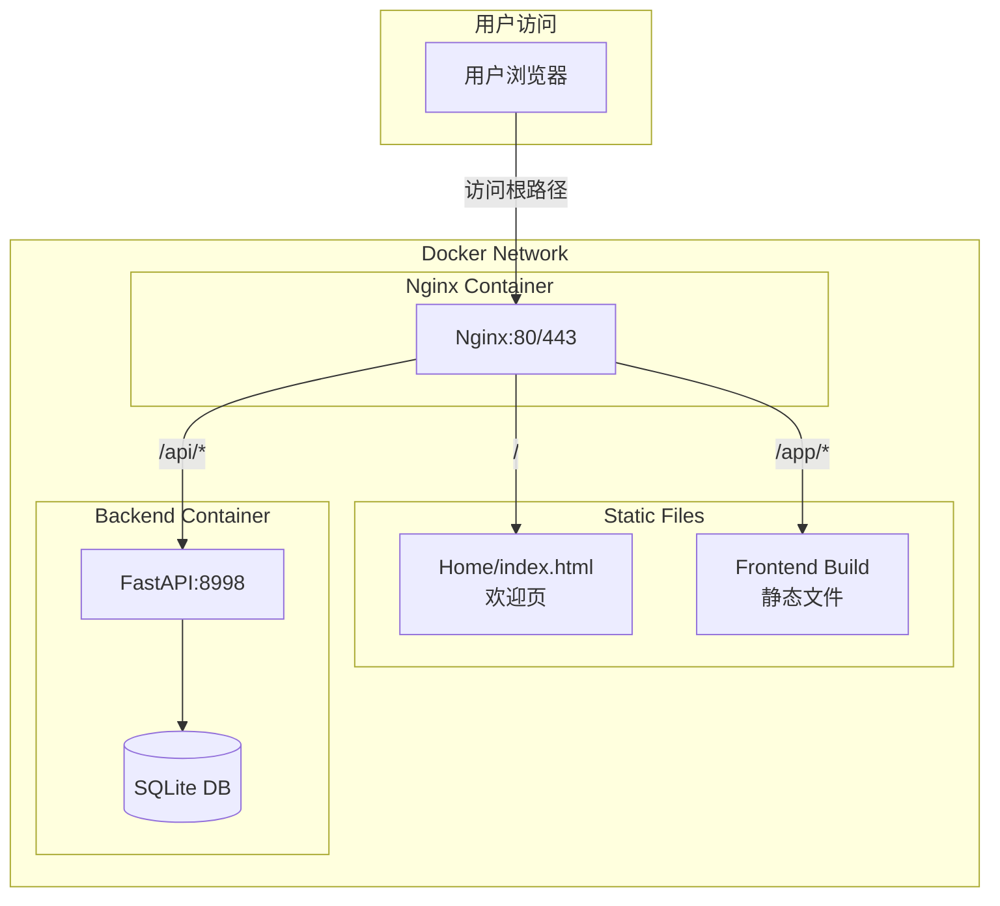
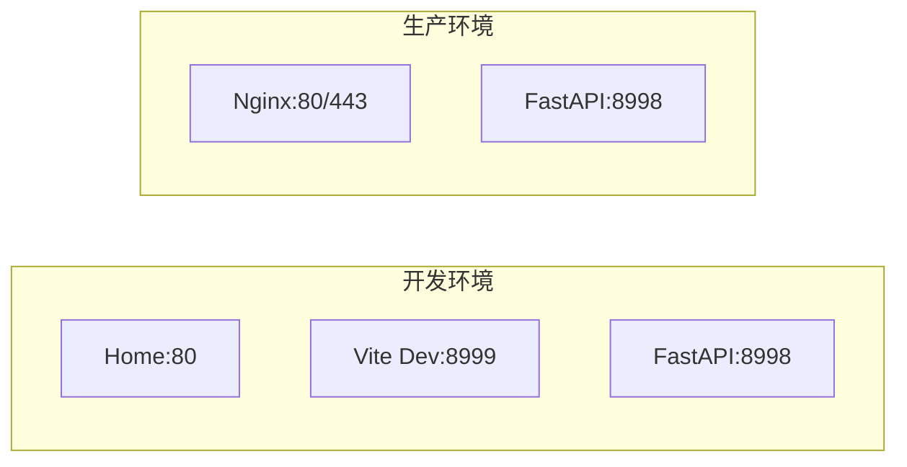

# Design Document: Docker Deployment

## Overview

本设计文档描述了项目的Docker容器化部署架构，包括：
- 欢迎页（Home）作为统一入口
- 前端（React/Vite）和后端（FastAPI）的容器化
- Nginx作为反向代理和静态文件服务器
- 跨操作系统的部署脚本

系统保持现有端口配置（前端开发8999，后端API 8998），生产环境通过Nginx统一对外暴露80/443端口。

## Architecture



### 部署模式



## Components and Interfaces

### 1. Nginx 反向代理

负责：
- 静态文件服务（欢迎页、前端构建产物）
- API请求代理到后端
- SSL终止（生产环境）

路由规则：
| 路径 | 目标 | 说明 |
|------|------|------|
| `/` | Home/index.html | 欢迎页 |
| `/app/` | Frontend静态文件 | 主应用 |
| `/api/` | Backend:8998 | API代理 |

### 2. 前端容器

- 构建阶段：使用Node镜像编译React应用
- 运行阶段：静态文件由Nginx服务

### 3. 后端容器

- 基于Python镜像
- 运行FastAPI应用
- 挂载数据卷持久化SQLite数据库

### 4. 配置管理

环境变量：
| 变量名 | 默认值 | 说明 |
|--------|--------|------|
| `DOMAIN` | localhost | 域名配置 |
| `APP_PORT` | 80 | 对外端口 |
| `BACKEND_PORT` | 8998 | 后端内部端口 |
| `SSL_ENABLED` | false | 是否启用SSL |

## Data Models

### 配置文件结构

```
deploy/
├── docker-compose.yml          # 主编排文件
├── docker-compose.dev.yml      # 开发环境覆盖
├── docker-compose.prod.yml     # 生产环境覆盖
├── .env.example                # 环境变量模板
├── nginx/
│   ├── nginx.conf              # Nginx主配置
│   └── conf.d/
│       └── default.conf        # 站点配置
├── Dockerfile.frontend         # 前端构建镜像
├── Dockerfile.backend          # 后端运行镜像
└── scripts/
    ├── start.sh                # Linux/macOS启动脚本
    ├── start.cmd               # Windows启动脚本
    ├── stop.sh                 # Linux/macOS停止脚本
    ├── stop.cmd                # Windows停止脚本
    └── logs.sh                 # 日志查看脚本
```

## Correctness Properties

*A property is a characteristic or behavior that should hold true across all valid executions of a system-essentially, a formal statement about what the system should do. Properties serve as the bridge between human-readable specifications and machine-verifiable correctness guarantees.*

由于本功能主要涉及基础设施配置和部署脚本，大部分验收标准需要运行时环境验证，不适合自动化属性测试。以下是可测试的属性：

### Property 1: URL Configuration Consistency

*For any* valid domain configuration (including localhost, IP addresses, and domain names), the generated application URL SHALL follow the pattern `{protocol}://{domain}:{port}/app/` where protocol is determined by SSL setting.

**Validates: Requirements 1.3, 1.4, 2.4**

### Property 2: Nginx Routing Completeness

*For any* request path, the Nginx configuration SHALL route to exactly one of: welcome page (root), frontend static files (/app/*), or backend API (/api/*).

**Validates: Requirements 4.3**

## Error Handling

### 容器启动失败

1. **后端数据库连接失败**
   - 检查数据卷挂载
   - 验证文件权限

2. **Nginx配置错误**
   - 使用 `nginx -t` 验证配置
   - 检查上游服务可达性

3. **端口冲突**
   - 检查端口占用
   - 修改 `.env` 配置

### 健康检查

```yaml
healthcheck:
  test: ["CMD", "curl", "-f", "http://localhost:8998/api/stats"]
  interval: 30s
  timeout: 10s
  retries: 3
```

## Testing Strategy

### 配置验证测试

由于本功能主要是基础设施配置，测试策略侧重于：

1. **配置文件语法验证**
   - Docker Compose配置有效性
   - Nginx配置语法检查
   - 环境变量模板完整性

2. **集成测试（手动）**
   - 容器启动顺序验证
   - 服务间通信验证
   - 路由规则验证

### Property-Based Testing

使用 `fast-check` 库进行属性测试：

- 测试URL生成逻辑的正确性
- 验证配置模板的变量替换

每个属性测试配置运行100次迭代。

测试文件命名格式：`*.property.test.ts`

测试注释格式：`**Feature: docker-deployment, Property {number}: {property_text}**`
