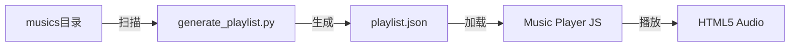

# Design Document: Home Music Player

## Overview

本设计文档描述首页音乐播放器的技术实现方案。播放器将集成到现有的 `Home/index.html` 页面中，提供自动扫描本地音乐目录、多格式支持、完整播放控制和播放列表管理功能。

由于 `Home/index.html` 是一个纯静态HTML页面，无法直接扫描文件系统，我们采用以下方案：
1. 创建一个 `playlist.json` 配置文件来维护音乐列表
2. 提供一个简单的 Python 脚本自动扫描 `musics` 目录并生成/更新 `playlist.json`
3. 前端 JavaScript 读取 `playlist.json` 并动态加载播放列表

## Architecture

```
Home/
├── index.html          # 主页面（包含播放器UI和逻辑）
├── musics/             # 音乐文件目录
│   ├── 艺术家 - 歌曲名.mp3
│   ├── 艺术家 - 歌曲名.flac
│   └── ...
├── playlist.json       # 自动生成的播放列表配置
└── generate_playlist.py # 扫描脚本（可选，用于自动生成playlist.json）
```

### 数据流



## Components and Interfaces

### 1. PlaylistGenerator (Python脚本)

负责扫描 `musics` 目录并生成 `playlist.json`。

```python
# 接口定义
def scan_music_directory(directory: str) -> List[TrackInfo]
def parse_filename(filename: str) -> TrackInfo
def generate_playlist_json(tracks: List[TrackInfo], output_path: str) -> None
```

### 2. MusicPlayer (JavaScript模块)

前端播放器核心逻辑。

```javascript
// 接口定义
class MusicPlayer {
    constructor(playlistUrl: string)
    
    // 播放列表管理
    async loadPlaylist(): Promise<void>
    getPlaylist(): Track[]
    getCurrentTrack(): Track | null
    
    // 播放控制
    play(): void
    pause(): void
    toggle(): void
    next(): void
    prev(): void
    playTrack(index: number): void
    
    // 状态管理
    saveState(): void
    restoreState(): void
    
    // 工具函数
    static parseTrackName(filename: string): { artist: string, title: string }
    static filterSupportedFormats(files: string[]): string[]
    static getNextIndex(current: number, total: number): number
    static getPrevIndex(current: number, total: number): number
}
```

### 3. PlaylistUI (JavaScript模块)

播放列表UI组件。

```javascript
// 接口定义
class PlaylistUI {
    constructor(container: HTMLElement, player: MusicPlayer)
    
    render(): void
    toggle(): void
    highlightCurrent(index: number): void
}
```

## Data Models

### Track (音轨信息)

```typescript
interface Track {
    filename: string;    // 原始文件名
    path: string;        // 相对路径 (如 "musics/xxx.mp3")
    artist: string;      // 艺术家名称
    title: string;       // 歌曲名称
    format: string;      // 文件格式 (mp3, flac, wav等)
}
```

### PlayerState (播放器状态)

```typescript
interface PlayerState {
    currentIndex: number;  // 当前播放索引
    volume: number;        // 音量 (0-1)
    isPlaying: boolean;    // 是否正在播放
}
```

### playlist.json 格式

```json
{
    "version": "1.0",
    "generatedAt": "2025-12-05T10:00:00Z",
    "tracks": [
        {
            "filename": "华晨宇 - 好想我回来啊.flac",
            "path": "musics/华晨宇 - 好想我回来啊.flac",
            "artist": "华晨宇",
            "title": "好想我回来啊",
            "format": "flac"
        }
    ]
}
```

## Correctness Properties

*A property is a characteristic or behavior that should hold true across all valid executions of a system-essentially, a formal statement about what the system should do. Properties serve as the bridge between human-readable specifications and machine-verifiable correctness guarantees.*

### Property 1: 文件名解析往返一致性
*For any* 有效的音轨信息（包含艺术家和歌曲名），将其格式化为文件名后再解析，应该得到相同的艺术家和歌曲名。
**Validates: Requirements 1.3**

### Property 2: 格式过滤正确性
*For any* 文件名列表，过滤函数返回的结果应该只包含支持的音频格式（mp3, flac, wav, ogg, aac, m4a, webm），且不遗漏任何支持的格式。
**Validates: Requirements 1.1, 2.5**

### Property 3: 索引导航循环正确性
*For any* 播放列表长度 n > 0 和当前索引 i (0 <= i < n)：
- getNextIndex(i, n) 应返回 (i + 1) % n
- getPrevIndex(i, n) 应返回 (i - 1 + n) % n
- 连续调用 n 次 getNextIndex 应回到原索引
**Validates: Requirements 3.3, 3.4, 3.6**

### Property 4: 状态持久化往返一致性
*For any* 有效的 PlayerState 对象，保存到 localStorage 后再恢复，应该得到等价的状态对象。
**Validates: Requirements 6.1, 6.2**

## Error Handling

| 错误场景 | 处理方式 |
|---------|---------|
| playlist.json 加载失败 | 显示"暂无音乐"提示，播放器保持可用但禁用播放按钮 |
| 音频文件加载失败 | 自动跳到下一首，控制台记录错误 |
| 不支持的音频格式 | 浏览器无法播放时自动跳过 |
| localStorage 不可用 | 降级处理，不保存状态 |
| 空播放列表 | 显示"暂无音乐"提示 |

## Testing Strategy

### 测试框架选择

由于这是一个纯前端项目，我们使用：
- **Vitest** - 单元测试和属性测试运行器
- **fast-check** - JavaScript 属性测试库

### 单元测试

1. `parseTrackName` 函数测试
   - 标准格式："艺术家 - 歌曲名.mp3"
   - 无艺术家格式："歌曲名.mp3"
   - 特殊字符处理

2. `filterSupportedFormats` 函数测试
   - 各种支持格式的识别
   - 不支持格式的过滤
   - 大小写不敏感

3. 索引导航函数测试
   - 边界情况（第一首、最后一首）
   - 循环逻辑

### 属性测试

每个属性测试配置运行 100 次迭代。

1. **Property 1 测试**: 生成随机艺术家名和歌曲名，验证解析往返一致性
2. **Property 2 测试**: 生成随机文件名列表（混合支持和不支持格式），验证过滤正确性
3. **Property 3 测试**: 生成随机播放列表长度和索引，验证导航循环正确性
4. **Property 4 测试**: 生成随机 PlayerState，验证序列化/反序列化往返一致性

### 测试文件结构

```
Home/
└── tests/
    ├── music-player.test.js      # 单元测试
    └── music-player.property.test.js  # 属性测试
```
