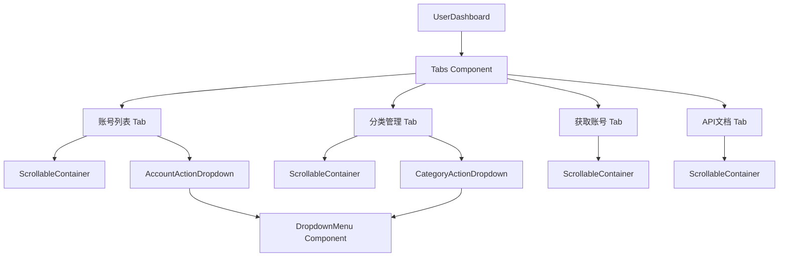

# Design Document

## Overview

本设计文档描述如何为用户仪表板的各个Tab内容区域添加滚动条功能，以及将操作按钮整合到下拉菜单中。主要改动包括：

1. 为账号列表、分类管理、获取账号、API文档四个Tab的内容区域添加固定高度和滚动条
2. 创建DropdownMenu组件用于整合操作按钮
3. 将账号列表和分类列表的操作按钮改为下拉菜单形式

## Architecture



## Components and Interfaces

### 1. DropdownMenu Component

新建 `frontend/src/components/ui/dropdown-menu.tsx`，基于 Radix UI 的 DropdownMenu 原语实现。

```typescript
// 主要导出组件
export {
  DropdownMenu,
  DropdownMenuTrigger,
  DropdownMenuContent,
  DropdownMenuItem,
  DropdownMenuSeparator,
}
```

### 2. ScrollableContainer 样式

通过CSS类实现滚动容器：

```css
.scrollable-table-container {
  max-height: 500px;  /* 或使用 calc(100vh - offset) */
  overflow-y: auto;
}

/* 表头固定 */
.sticky-header {
  position: sticky;
  top: 0;
  z-index: 10;
  background: var(--background);
}
```

### 3. AccountActionDropdown

账号列表操作下拉菜单，包含：
- 编辑 (Edit)
- 禁用/启用 (Toggle)
- 重置 (Reset)
- 删除 (Delete)

### 4. CategoryActionDropdown

分类列表操作下拉菜单，包含：
- 删除 (Delete)

## Data Models

无新增数据模型，复用现有的 Account 和 Category 接口。

## Correctness Properties

*A property is a characteristic or behavior that should hold true across all valid executions of a system-essentially, a formal statement about what the system should do. Properties serve as the bridge between human-readable specifications and machine-verifiable correctness guarantees.*

### Property 1: 下拉菜单操作功能一致性

*For any* 账号列表中的账号行，当用户通过下拉菜单选择任意操作时，该操作的执行结果应与原有平铺按钮的执行结果完全一致。

**Validates: Requirements 6.3**

### Property 2: 分类下拉菜单操作功能一致性

*For any* 分类列表中的分类行，当用户通过下拉菜单选择删除操作时，该操作的执行结果应与原有删除按钮的执行结果完全一致。

**Validates: Requirements 7.3**

## Error Handling

1. **滚动条渲染失败**: 使用CSS fallback确保即使自定义滚动条样式失败，浏览器默认滚动条仍可用
2. **下拉菜单无法展开**: 确保DropdownMenu组件有正确的z-index，避免被其他元素遮挡
3. **操作执行失败**: 复用现有的toast提示机制显示错误信息

## Testing Strategy

### Unit Tests

- 验证DropdownMenu组件正确渲染
- 验证滚动容器CSS类正确应用
- 验证表头sticky定位正确

### Property-Based Tests

使用 Vitest 进行测试：

1. **Property 1 测试**: 对于任意账号，验证下拉菜单中的每个操作（编辑、禁用/启用、重置、删除）调用的处理函数与原有按钮相同
2. **Property 2 测试**: 对于任意分类，验证下拉菜单中的删除操作调用的处理函数与原有按钮相同

### Integration Tests

- 验证滚动时表头保持固定
- 验证下拉菜单点击后正确展开
- 验证操作执行后UI正确更新

