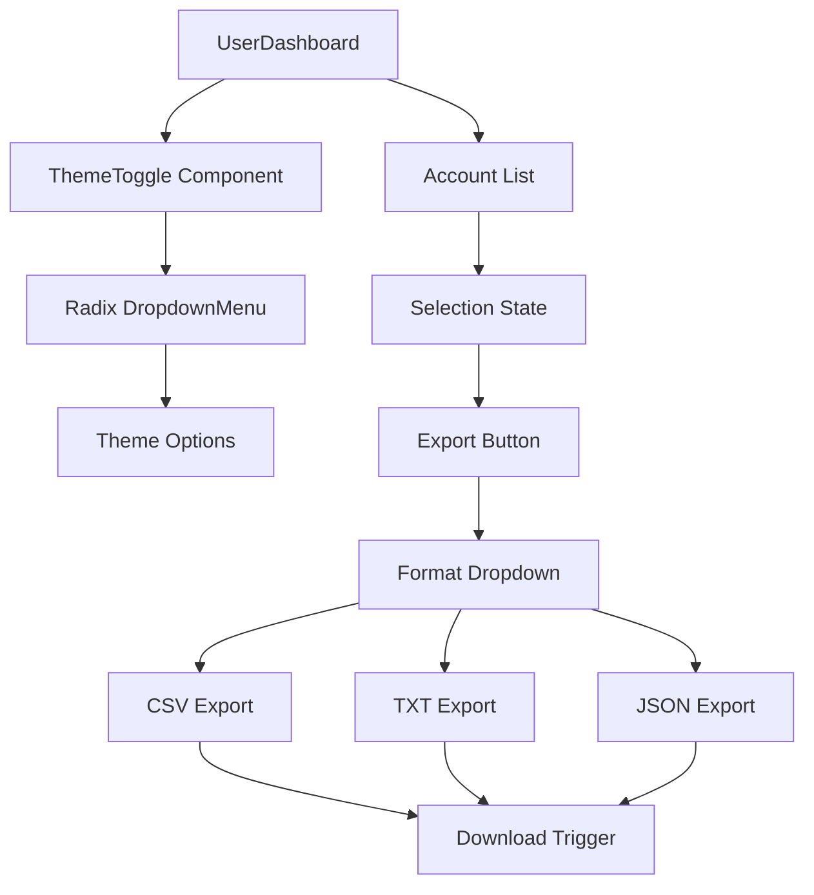

# Design Document

## Overview

本设计文档描述如何修复主题切换下拉菜单的可见性问题，以及如何实现账号多选导出功能。主要改动包括：

1. 改进 ThemeToggle 组件，使用 Radix UI 的 DropdownMenu 替代自定义实现，自动处理边界检测和位置调整
2. 在账号列表中添加导出按钮和格式选择菜单
3. 实现 CSV、TXT、JSON 三种格式的导出功能

## Architecture



## Components and Interfaces

### 1. ThemeToggle Component (改进)

使用 Radix UI DropdownMenu 替代自定义下拉菜单实现：

```typescript
// frontend/src/components/ui/theme-toggle.tsx
import {
  DropdownMenu,
  DropdownMenuContent,
  DropdownMenuItem,
  DropdownMenuTrigger,
} from "@/components/ui/dropdown-menu"

export function ThemeToggle() {
  // 使用 Radix DropdownMenu，自动处理边界检测
  // collisionPadding 确保与视口边缘保持距离
  // side="bottom" align="end" 设置默认展开方向
}
```

### 2. Export Utilities

新建导出工具函数：

```typescript
// frontend/src/lib/export-utils.ts

interface ExportAccount {
  email: string
  password: string
}

// CSV 导出（处理特殊字符转义）
export function exportToCSV(accounts: ExportAccount[]): string

// TXT 导出（邮箱----密码 格式）
export function exportToTXT(accounts: ExportAccount[]): string

// JSON 导出
export function exportToJSON(accounts: ExportAccount[]): string

// 触发文件下载
export function downloadFile(content: string, filename: string, mimeType: string): void

// 生成文件名
export function generateFilename(count: number, format: 'csv' | 'txt' | 'json'): string
```

### 3. Export Button Component

在账号列表的批量操作区域添加导出按钮：

```typescript
// 在 UserDashboard.tsx 中添加
{selectedAccountIds.length > 0 && (
  <DropdownMenu>
    <DropdownMenuTrigger asChild>
      <Button variant="outline" size="sm">
        <Download className="mr-2 h-4 w-4" />
        导出 ({selectedAccountIds.length})
      </Button>
    </DropdownMenuTrigger>
    <DropdownMenuContent>
      <DropdownMenuItem onClick={() => handleExport('csv')}>
        导出为 CSV
      </DropdownMenuItem>
      <DropdownMenuItem onClick={() => handleExport('txt')}>
        导出为 TXT
      </DropdownMenuItem>
      <DropdownMenuItem onClick={() => handleExport('json')}>
        导出为 JSON
      </DropdownMenuItem>
    </DropdownMenuContent>
  </DropdownMenu>
)}
```

## Data Models

复用现有的 Account 接口，导出时只使用 email 和 password 字段：

```typescript
interface ExportAccount {
  email: string
  password: string
}
```

## Correctness Properties

*A property is a characteristic or behavior that should hold true across all valid executions of a system-essentially, a formal statement about what the system should do. Properties serve as the bridge between human-readable specifications and machine-verifiable correctness guarantees.*

### Property 1: 下拉菜单视口边界约束

*For any* 触发器位置和视口大小组合，当下拉菜单展开时，下拉菜单的边界应完全在视口可视区域内。

**Validates: Requirements 1.1, 1.2**

### Property 2: 导出数据 Round-Trip 一致性

*For any* 账号列表，导出为 JSON 格式后再解析回来，应该得到与原始数据等价的账号列表（包含相同的 email 和 password）。

**Validates: Requirements 2.5, 3.2**

### Property 3: CSV 特殊字符转义正确性

*For any* 包含逗号、引号或换行符的账号数据，导出为 CSV 格式后，每个字段应被正确转义，使得 CSV 解析器能够正确还原原始数据。

**Validates: Requirements 2.3, 3.1**

### Property 4: TXT 格式一致性

*For any* 账号列表，导出为 TXT 格式后，每行应包含一个账号，格式为 "邮箱----密码"，且行数等于账号数量。

**Validates: Requirements 2.4, 3.2**

### Property 5: 文件名格式正确性

*For any* 账号数量和导出格式，生成的文件名应包含当前日期和账号数量信息。

**Validates: Requirements 3.3**

## Error Handling

1. **空选择导出**: 当没有选中账号时，导出按钮不显示
2. **下载失败**: 使用 try-catch 捕获下载错误，通过 toast 提示用户
3. **特殊字符处理**: CSV 导出时正确转义特殊字符，避免格式错误

## Testing Strategy

### Unit Tests

- 验证 ThemeToggle 组件正确渲染
- 验证导出按钮在选中账号时显示
- 验证各格式导出函数的基本功能

### Property-Based Tests

使用 Vitest 和 fast-check 进行属性测试：

1. **Property 2 测试**: 生成随机账号列表，验证 JSON 导出后解析回来数据一致
2. **Property 3 测试**: 生成包含特殊字符的账号数据，验证 CSV 转义正确
3. **Property 4 测试**: 生成随机账号列表，验证 TXT 导出格式正确
4. **Property 5 测试**: 生成随机账号数量和格式，验证文件名格式正确

测试配置：
- 每个属性测试运行至少 100 次迭代
- 使用 fast-check 库生成测试数据
- 测试注释格式：`**Feature: theme-export-enhancement, Property {number}: {property_text}**`

