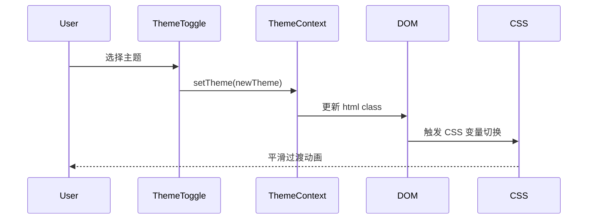

# Design Document: Theme Refactor

## Overview

本设计文档描述了主题系统重构的技术方案，旨在将现有的6种主题（浅色、深色、海洋蓝、日落橙、森林绿、赛博朋克）升级为符合现代化商业风格的统一设计系统。重构将优化CSS变量体系、增强视觉层次感、统一组件样式，并确保所有主题都具有专业的外观和良好的可访问性。

## Architecture

### 设计系统架构

```
┌─────────────────────────────────────────────────────────────┐
│                    Theme System Architecture                 │
├─────────────────────────────────────────────────────────────┤
│                                                              │
│  ┌──────────────┐    ┌──────────────┐    ┌──────────────┐  │
│  │  CSS Tokens  │───▶│ Theme Config │───▶│  Components  │  │
│  │  (index.css) │    │  (Context)   │    │   (UI Kit)   │  │
│  └──────────────┘    └──────────────┘    └──────────────┘  │
│         │                   │                    │          │
│         ▼                   ▼                    ▼          │
│  ┌──────────────────────────────────────────────────────┐  │
│  │              Unified Design Language                  │  │
│  │  • Color Palette (Primary, Secondary, Accent)        │  │
│  │  • Typography Scale                                   │  │
│  │  • Spacing System                                     │  │
│  │  • Shadow & Elevation                                 │  │
│  │  • Border Radius                                      │  │
│  └──────────────────────────────────────────────────────┘  │
│                                                              │
└─────────────────────────────────────────────────────────────┘
```

### 主题切换流程



## Components and Interfaces

### 1. CSS 变量体系 (index.css)

扩展现有的CSS变量系统，增加更多设计令牌：

```typescript
interface ThemeTokens {
  // 基础颜色
  background: string;
  foreground: string;
  card: string;
  cardForeground: string;
  
  // 主要颜色
  primary: string;
  primaryForeground: string;
  
  // 次要颜色
  secondary: string;
  secondaryForeground: string;
  
  // 强调色
  accent: string;
  accentForeground: string;
  
  // 静音色
  muted: string;
  mutedForeground: string;
  
  // 边框和输入
  border: string;
  input: string;
  ring: string;
  
  // 新增：阴影系统
  shadowSm: string;
  shadowMd: string;
  shadowLg: string;
  
  // 新增：渐变
  gradientFrom: string;
  gradientTo: string;
  
  // 新增：表面层级
  surfaceElevated: string;
  surfaceOverlay: string;
}
```

### 2. ThemeContext 接口

```typescript
interface ThemeContextType {
  theme: Theme;
  setTheme: (theme: Theme) => void;
  themes: ThemeOption[];
}

interface ThemeOption {
  value: Theme;
  label: string;
  icon: string;
  preview: {
    primary: string;
    secondary: string;
    accent: string;
  };
}
```

### 3. 组件样式增强

#### Button 组件
- 增加渐变变体
- 优化悬停和点击状态
- 添加微妙的阴影效果

#### Card 组件
- 增加悬停提升效果
- 优化边框和阴影
- 添加玻璃态变体选项

#### Sidebar 组件
- 现代化导航样式
- 优化活动状态指示器
- 增加微妙的背景渐变

## Data Models

### 主题配置模型

```typescript
type Theme = 'light' | 'dark' | 'ocean' | 'sunset' | 'forest' | 'cyberpunk';

interface ThemeConfig {
  name: Theme;
  displayName: string;
  icon: string;
  colors: {
    // HSL 格式的颜色值
    background: [number, number, number];
    foreground: [number, number, number];
    primary: [number, number, number];
    // ... 其他颜色
  };
  shadows: {
    sm: string;
    md: string;
    lg: string;
  };
}
```

## Correctness Properties

*A property is a characteristic or behavior that should hold true across all valid executions of a system-essentially, a formal statement about what the system should do. Properties serve as the bridge between human-readable specifications and machine-verifiable correctness guarantees.*

### Property Reflection

经过分析，以下属性可以合并或简化：
- 2.1, 2.2, 2.3 都涉及对比度测试，可以合并为一个通用的对比度属性
- 2.4 和 5.1 都涉及交互状态，但测试角度不同，保持独立

### Property 1: Theme Switching Preserves DOM Structure
*For any* theme switch operation, the DOM structure (element count and hierarchy) SHALL remain unchanged after the theme class is applied to the document root.
**Validates: Requirements 1.2**

### Property 2: All Themes Have Complete CSS Variable Definitions
*For any* theme in the theme list, all required CSS variables (background, foreground, primary, secondary, accent, muted, border, input, ring) SHALL be defined with valid HSL values.
**Validates: Requirements 2.1, 2.2, 2.3**

### Property 3: Text Contrast Ratio Compliance
*For any* theme, the contrast ratio between foreground and background colors SHALL meet WCAG AA standards (minimum 4.5:1 for normal text).
**Validates: Requirements 2.1, 2.2, 2.3**

### Property 4: Interactive Element State Differentiation
*For any* interactive element (button, link, menu item), the hover state color SHALL differ from the default state color by a measurable amount.
**Validates: Requirements 2.4**

### Property 5: Primary Button Prominence
*For any* theme, primary buttons SHALL have a contrast ratio of at least 3:1 against the background, ensuring visual prominence.
**Validates: Requirements 5.1**

## Error Handling

### 主题加载失败
- 如果 localStorage 中的主题值无效，回退到默认主题 (light)
- 如果 CSS 变量未定义，使用 CSS fallback 值

### 主题切换错误
- 捕获 DOM 操作异常
- 记录错误但不中断用户体验
- 提供视觉反馈表明切换失败

## Testing Strategy

### 单元测试
- 测试 ThemeContext 的状态管理
- 测试主题切换函数
- 测试 CSS 变量解析工具函数

### 属性测试 (Property-Based Testing)

使用 fast-check 库进行属性测试：

1. **主题切换属性测试**: 验证任意主题切换后 DOM 结构保持不变
2. **CSS 变量完整性测试**: 验证所有主题都定义了必需的 CSS 变量
3. **对比度合规性测试**: 验证所有主题的文本对比度符合 WCAG AA 标准
4. **交互状态测试**: 验证所有交互元素的状态变化可见

### 测试配置
- 每个属性测试运行至少 100 次迭代
- 使用 vitest 作为测试运行器
- 使用 fast-check 作为属性测试库

